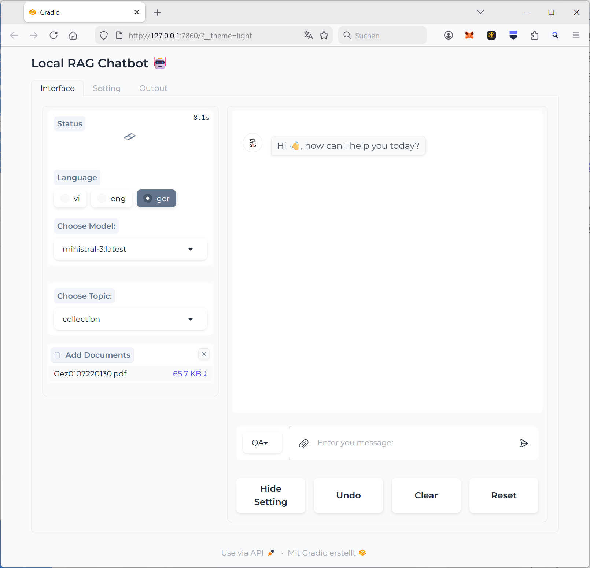
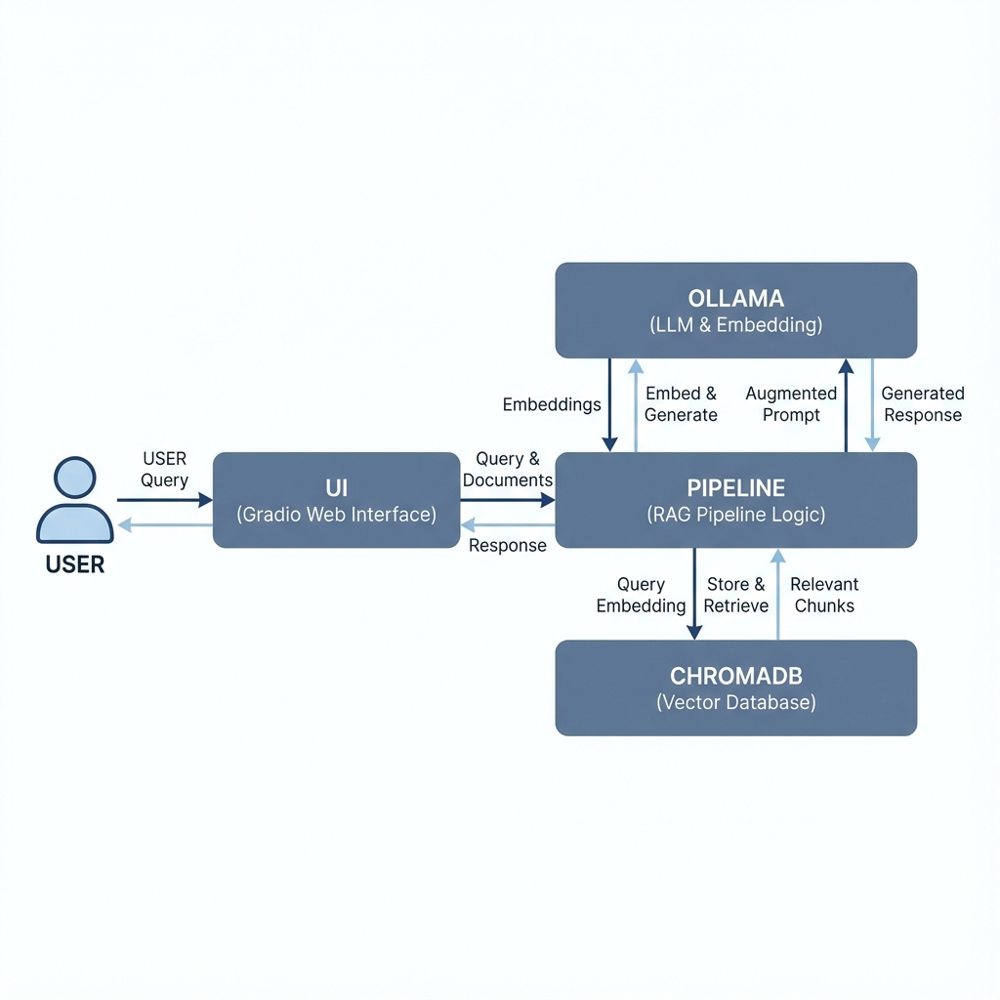
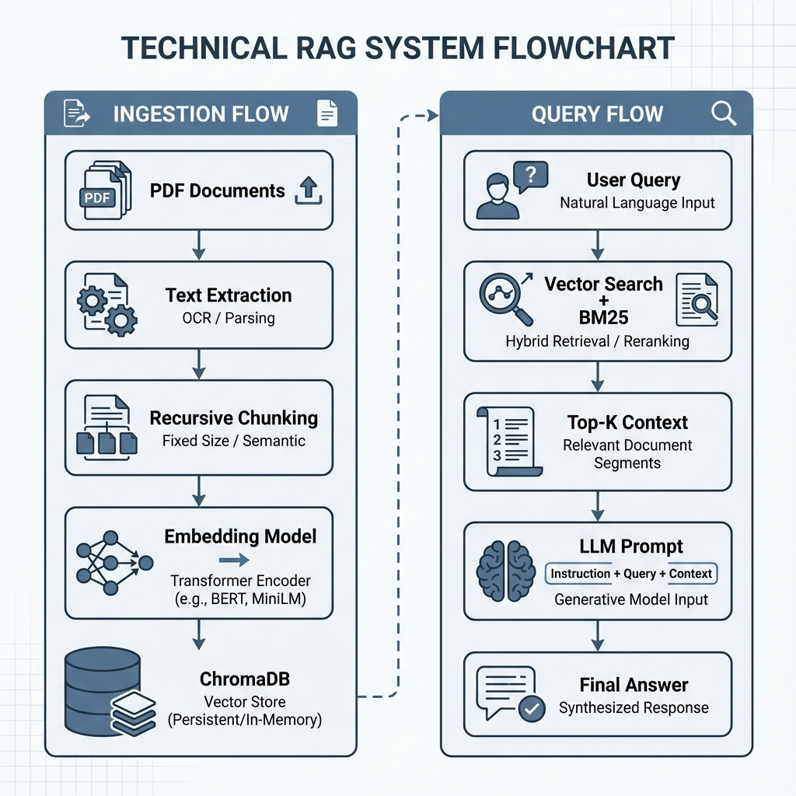

# RAG based local document chat (pdf, docx, txt, xls, eml)




## 📖 Table of Contents

- [📖 Table of Contents](#-table-of-contents)
- [⭐️ Key Features](#️-key-features)
- [🏗 Architecture](#-architecture)
  - [High-Level Overview](#high-level-overview)
  - [RAG Pipeline Deep Dive](#rag-pipeline-deep-dive)
  - [Detailed Workflows](#detailed-workflows)
- [💻 Setup](#-setup)
- [1. Clone Project](#1-clone-project)
- [2. Installation](#2-installation)
- [3. Execution](#3-execution)
- [4. Open Browser](#4-open-browser)

## ⭐️ Key Features

- Easy execution on local hardware (Windows/Linux/Mac)
- Supports any model from `Huggingface` and `Ollama`
- **Multi-Topic Support**: Switch between different vector databases (contexts) on the fly
- **Selective Deletion**: Delete specific topics or the entire database safely
- **Windows Optimized**: Robust handling of file locks and Unicode characters (UTF-8)
- Process multiple PDF/TXT/CSV inputs
- Chat in multiple languages
- Simple UI powered by `Gradio`

## 🏗 Architecture

### High-Level Overview

The application is designed as a modular local system. Here is a high-level overview of the interactions:



### Component Overview

*   **Gradio UI**: The web interface for interaction and document uploads.
*   **RAG Pipeline**: The brain that coordinates ingestion, retrieval, and generation.
*   **Ollama**: Acts as a local AI server for LLMs (e.g., Llama3) and Embeddings (e.g., Nomic-Embed-Text).
*   **ChromaDB**: A persistent local vector database that safely stores your data on disk.
*   **Multi-Topic Storage**: Isolated storage contexts per topic, allowing for clean context switching.
*   **Ingestion**: Processes PDFs/TXTs/CSVs, splits them into logical chunks, and prepares them for indexing.
*   **Safety Cleanup**: Integrated logic to release Windows file handles before clearing data.


### RAG Pipeline Deep Dive

The system uses a sophisticated **Two-Stage Retrieval** architecture to ensure the highest possible answer quality:

#### 🧠 Hybrid Search (The Foundation)
Instead of relying solely on "meaning" (Vector Search), the pipeline combines two powerful strategies:
- **Vector Index Retrieval**: Finds chunks that are semantically similar (even if they use different words).
- **BM25 Retrieval**: A classical keyword-matching algorithm that excels at finding specific technical terms or unique identifiers.

#### 🚦 Intelligent Routing
The `LocalRetriever` acts as a traffic controller. It uses an **LLM Selector** to analyze your query:
- **Fusion Tool**: Used for ambiguous queries. It generates 4 variations of your question to "broaden the net".
- **Two-Stage Tool**: Used for clear queries. It focuses on precision and direct matching.

#### 🎯 Second-Stage Reranking
After gathering the best candidates from both keyword and vector search, the system doesn't stop. It uses a specialized **Reranker Model** (`bge-reranker-base`) to score the relationship between your question and each chunk. Only the absolute top-scoring chunks are passed to the LLM to generate the final answer.


### Detailed Workflows

For a deeper technical understanding, here is how the data flows through the system during different stages:



#### 1. Ingestion Flow (Document Processing)
When you upload a document, the following steps occur:
- **PDF/Text Loading**: Documents are parsed and text is extracted using local readers.
- **Recursive Chunking**: Large texts are split into smaller, overlapping chunks to maintain context while staying within the model's window.
- **Embedding Generation**: Each chunk is sent to the local **Ollama** server using the `nomic-embed-text` model to create high-dimensional vector representations.
- **Vector Storage**: These vectors, along with the source text, are saved into a persistent **ChromaDB** collection on your disk.

#### 2. Query Flow (Chatting)
When you ask a question, the system performs a hybrid search:
- **Query Embedding**: Your question is converted into a vector.
- **Hybrid Retrieval**: The's engine combines **Vector Search** (semantic similarity) and **BM25 Retrieval** (keyword matching) to find the most relevant document segments.
- **Context Ranking**: The retrieved segments are ranked and the top most relevant chunks are selected as "context".
- **LLM Synthesis**: The original query + the selected context + a system prompt are sent to the local **Ollama LLM** (e.g., Llama 3) to generate a grounded, accurate response.

## 💻 Setup

### 1. Clone Project

```bash
git clone https://github.com/tblock-zz/RagMa.git
cd ragMe
```

### 2. Installation

#### 2.1 Install `uv` (one-time) (Windows11)

```
winget install astral-sh.uv
```
to upgrade use:
```
winget upgrade astral-sh.uv
```

#### 2.2 Install `Ollama` 
Download and install Ollama for Windows directly from [ollama.com](https://ollama.com/).

#### 2.3 Install Dependencies
```bash
uv sync --locked
```

### 3. Execution

To start the application, run this command in the project directory:

```powershell
uv run python -m src
```

If you want to share the application over the internet (via Gradio Share/Ngrok):

```powershell
uv run python -m src --share
```

### 4. Open Browser
Navigate to: `http://127.0.0.1:7860/` once the server is running.

---

# Credits

This project is based on the [rag-chatbot](https://github.com/datvodinh/rag-chatbot) project.

# Notes
It has been modified also using AI for coding.

